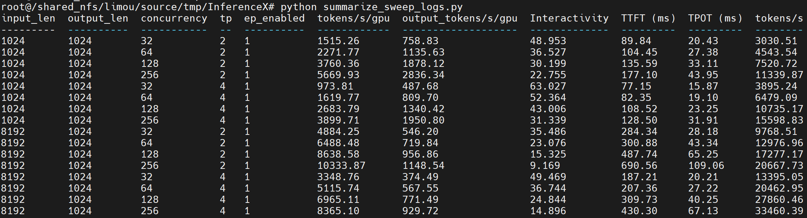

# Benchmarking MiniMax-M2.5 (FP8) on AMD MI355X with vLLM

This guide walks you through running the [InferenceX (`dev/minimax` branch)](https://github.com/limou102/InferenceX/tree/dev/minimax) inference benchmark for `MiniMaxAI/MiniMax-M2.5` on an AMD MI355X host, using the `vllm/vllm-openai-rocm:v0.19.0` container.

---

## Prerequisites

- A Hugging Face access token with permission to pull `MiniMaxAI/MiniMax-M2.5`.
- Outbound network access for Hugging Face and GitHub.

---

## 1. Start and Enter the Docker Container

Launch the container in the background (it stays alive until you stop it):

```bash
docker run \
  -d \
  --rm \
  --name=vllm-rocm-benchmark \
  --ipc=host \
  --network=host \
  --device=/dev/kfd \
  --device=/dev/dri \
  --cap-add=SYS_PTRACE \
  --cap-add=CAP_SYS_ADMIN \
  --security-opt seccomp=unconfined \
  --group-add video \
  --privileged \
  --device=/dev/infiniband \
  --entrypoint /bin/bash \
  -it vllm/vllm-openai-rocm:v0.19.0
```

Then attach an interactive shell:

```bash
docker exec -it vllm-rocm-benchmark bash
```

All subsequent commands are run **inside** the container.

---

## 2. Prepare the Code and Environment

```bash
cd /root/
git clone -b dev/minimax https://github.com/limou102/InferenceX.git
cd InferenceX

# or set MODEL to local path
# but need to comment the line which downloads model in benchmarks/single_node/minimaxm2.5_fp8_mi355x.sh
export MODEL=MiniMaxAI/MiniMax-M2.5
export HF_TOKEN=<your_huggingface_access_token>
```

> Replace `<your_huggingface_access_token>` with a real token (for example `hf_xxxxxxxx...`). The benchmark script will fail fast if `HF_TOKEN` is empty.

By default, Hugging Face weights are cached under `/mnt/hf_hub_cache`. You can override this with `export HF_HUB_CACHE=/path/to/cache` before running the benchmark.

---

## 3. Launch the Inference Server and Run the Benchmark

### 3.1 Single-case benchmark

Run one parameter combination end-to-end (launches vLLM, runs the client load test, then tears everything down):

```bash
bash run_local_minimax_mi355x.sh
```

Key knobs you can override via environment variables before running the script:


| Variable     | Default | Description                                                   |
| ------------ | ------- | ------------------------------------------------------------- |
| `ISL`        | `1024`  | Input sequence length (typical options: `1024`, `8192`)       |
| `OSL`        | `1024`  | Output sequence length                                        |
| `CONC`       | `64`    | Client concurrency (typical: `4, 8, 16, 32, 64, 128`)         |
| `TP_SIZE`    | `4`     | Tensor parallel size                                          |
| `EP_ENABLED` | `1`     | `1` enables expert parallel (`EP_SIZE = TP`); `0` disables it |
| `PORT`       | `8888`  | vLLM OpenAI-compatible server port                            |


Example:

```bash
ISL=8192 OSL=1024 CONC=128 TP_SIZE=4 bash run_local_minimax_mi355x.sh
```

### 3.2 Parameter sweep benchmark

Iterate over a predefined grid of `(ISL, OSL, TP, EP_ENABLED, CONC)` combinations and run the full benchmark for each:

```bash
bash run_local_minimax_mi355x_sweep.sh
```

Per-run logs are written to `./sweep-logs/`:

- `isl{ISL}_osl{OSL}_tp{TP}_ep{EP}_conc{CONC}.log` — client/driver log
- `server_isl{ISL}_osl{OSL}_tp{TP}_ep{EP}_conc{CONC}.log` — archived vLLM server log

---

## 4. Collect Performance Metrics

After a sweep finishes, aggregate all runs into a single table and CSV:

```bash
python3 summarize_sweep_logs.py
```

---

## 5. (Optional) Verify the Server and Run Accuracy Evaluation

### 5.1 Quick sanity check

With the server running (port `8888` by default), send a test request:

```bash
curl http://localhost:8888/v1/chat/completions \
  -H "Content-Type: application/json" \
  -d '{
    "model": "MiniMaxAI/MiniMax-M2.5",
    "messages": [{"role": "user", "content": "1+1=?"}],
    "max_tokens": 32,
    "temperature": 0
  }'
```

### 5.2 Accuracy evaluation (GSM8K)

To skip the throughput benchmark and run only the evaluation task (default: `gsm8k`):

```bash
EVAL_ONLY=true RUN_EVAL=true ISL=4096 OSL=4096 bash run_local_minimax_mi355x.sh
```

This will start vLLM with an evaluation-sized context, run `lm-eval`, and then shut down. Expect it to take a while to complete.

---

## Reference Benchmark Result

A reference throughput/interactivity curve on MI355X is shown below:



The numbers produced by the steps above are aligned with the official InferenceX public dashboard — you can cross-check your results against the same model, precision, and hardware configuration here:

[InferenceX — MiniMax-M2.5 · FP8 · MI355X (run 2026-04-05)](https://inferencex.semianalysis.com/inference?g_rundate=2026-04-17&g_model=MiniMax-M2.5&i_prec=fp8&g_runid=24588340987)

